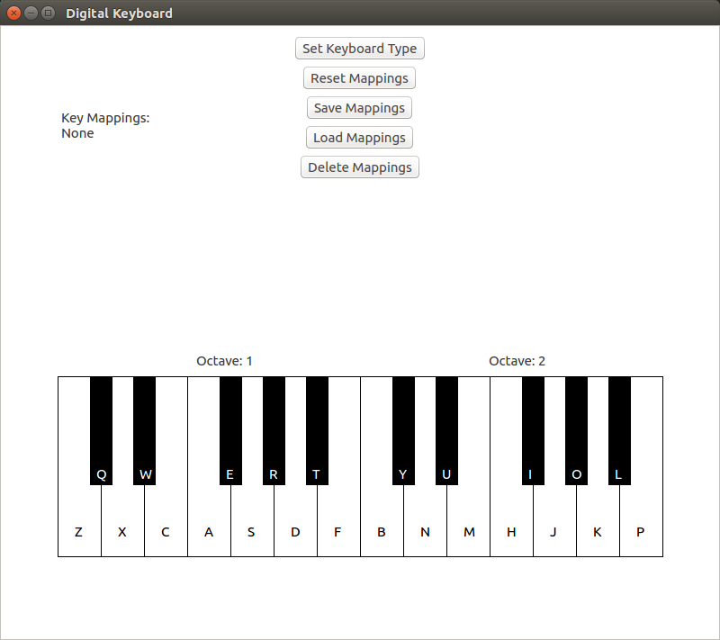

# Digital Keyboard

Welcome to the Digital Keyboard project! We are focused on allowing people with physical limitations to play music on a digital keyboard using universal design principles.

## Instructions to run source on linux

Install dependencies:
* Clone our repo: `git clone https://github.com/killalea/digital-keyboard.git`
* Be sure you are running Python 2.7
* Install python requirements: `pip install -r requirements.txt`
* Install pyqt: `sudo apt-get install python-pyqt5`
* To set up database `python setup_db.py`

Get audio priveleges:
* Output your username: `whoami`
* Give your user audo privileges `sudo adduser [your username] audio`
* Then you have to reboot
* Check that you have proper privileges: `ulimit -r -l`

## Usage

To run
* `python digital_keyboard.py`

To create a note mapping
* Click a key, or multiple keys (if you press reset when they're highlighted, it will clear)
* Press the key you would like to map them to
* Press reset to clear mappings
* Press save to save mappings

To load a previously saved or built in mapping, press the load button. The delete button works similarly.

We automatically support "asfd" and BAT keyboards. To select your keyboard, use the keyboard type button.

Other functions:
* The number keys and arrows switch octaves
* The space key functions as the sustain peddle
* The tab key will kill the peddle
* Press the escape key to quit

## Our roots

This project is built off of this repository: https://github.com/kosterjo/eecs481DigitalInsturment and was originally developed by:
Brendan Killalea (Me), John Koster, Brian Lim, and Thomas Finch. 

### Useful resources

* Used to make sound: http://bspaans.github.io/python-mingus/
* Used to pick out colorblind friendly colors: http://colorbrewer2.org/#type=diverging&scheme=RdGy&n=3
* Used to set up audio privileges: https://ubuntuforums.org/archive/index.php/t-1637399.html

